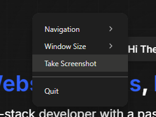

<div align="center">
  <picture>
      
  </picture>
  <h1>Screencapture Browser (scb)</h1>
  <p>Screencapture Browser (scb) is a frameless CLI browser designed for taking screenshots of websites. It provides both a CLI and an API for capturing screenshots.</p>

  <p align="center">
  <a aria-label="NPM version" href="https://www.npmjs.com/package/scb">
    
  </a>
  <a aria-label="Size" href="https://www.npmjs.com/package/scb">
    
  </a>
  <a aria-label="NPM Downloads" href="https://www.npmjs.com/package/scb">
    
  </a>
    <a aria-label="License" href="https://www.npmjs.com/package/scb">
    
    </a>
</p>
</div>

## Installation

To install the package, use npm:

```bash
npm install -g scb
# or
yarn global add scb
# or
pnpm add -g scb
# or
bun install -g scb
```

## CLI Usage

To open a headless and frameless browser window, use the following command:

```bash
scb --url=<websiteUrl> [--size=WxH] [--optimized] [--noJS]
```

Then, right-click on the page and select "Take Screenshot" from the context menu.



### CLI Options

- `--url`: The URL of the website to open.
- `--size`: The size of the window in the format `WxH` (default: `1280x720`).
- `--optimized`: Run the website in optimized mode.
- `--noJS`: Disable JavaScript on the website.

## API Usage

You can also use the API to take screenshots programmatically.

### Example

```js
import { takeScreenshot } from 'scb';

const url = 'https://example.com';
const options = {
    width: 1920,
    height: 1080,
    noJS: false
};

takeScreenshot(url, options)
    .then(buffer => {
        // Do something with the screenshot buffer
    })
    .catch(error => {
        console.error('Error taking screenshot:', error);
    });
```

### API Options

- `url`: The URL of the website to take a screenshot of.
- `options`: An object containing the following properties:
  - `width`: The width of the screenshot (default: `1280`).
  - `height`: The height of the screenshot (default: `720`).
  - `noJS`: Disable JavaScript on the website (default: `false`).